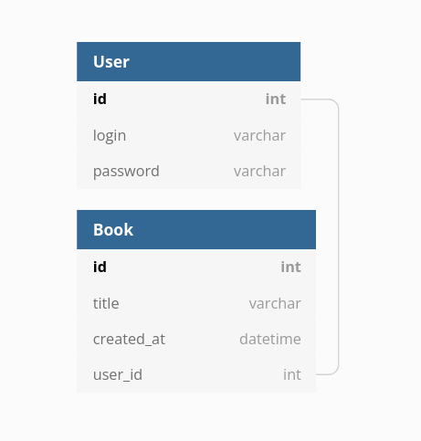
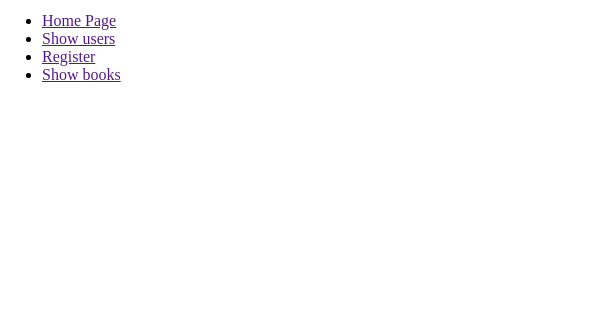
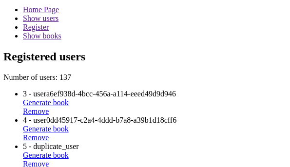
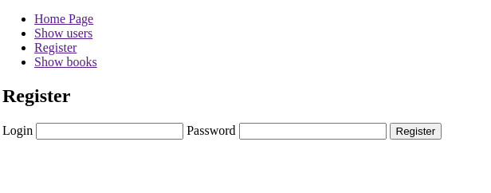
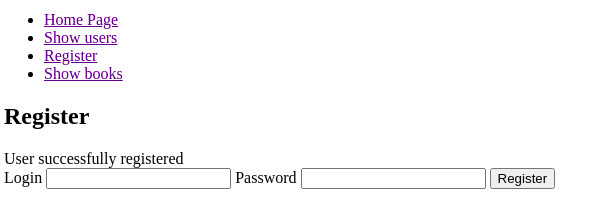
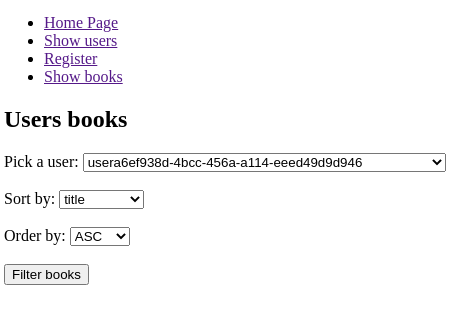
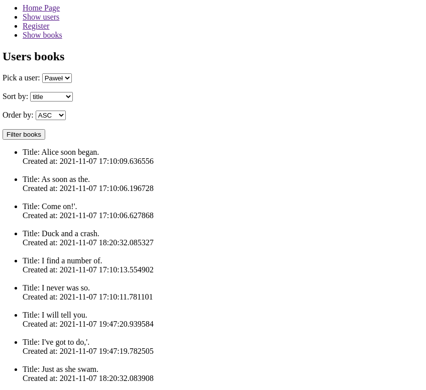

# 1. Temat Zadania

---

__Przy użyciu mikroframeworku Flask stwórz aplikację implementującą wzorzec MVC.__

---

Aplikacja powinna realizować następujące zadania:

1. Posiadać endpointy, renderować przypisane do nich templatki i implementować określone czynności:  

    1.1. Nazwa endpointu `index`, adres endpointu `/`, templatka `base.html`. W tej templatce mają się znajdować linki do pozostałych templatek.
    
    1.2. Nazwa endpointu `show_users`, adres endpointu `/users`, templatka `show_users.html`. 

      Renderowana templatka ma 
      przyjmować z widoku kontent w zdefiniowanych kluczach:
      - `users` ma być to lista wszystkich instancji modelu `User` z bazy danych. Poszczególne elementy listy mogą być wyświtlane w liście HTML w divach etc.
      - `number_of_users` ma być to liczba całkowita reprezentująca liczbę użytkowników w bazie danych. Ta liczba ma się wyświetlać w osobnym paragrafie z informacją że chodzi o liczbę wszystkich użytkowników
   
   1.3. Nazwa endpointu `register`, adres endpointu `/register`, templatka `register.html`.
      
      Widok `register` na żądanie:
      - `GET` ma tylko renderować templatkę, na której ma się znajdować formularz HTML do tworzenia nowego użytkownika. Formularz ma przekazywać dane do widoku `register` metodą `POST`.
      - `POST` ma: 
        - pobierać dane z formularza _(login, password)_.
        - zwalidować na poziomie widoku czy dane zostały przekazane przez użytkownika, nie ma być falidacji na poziomie HTML:
            - jeśli użytkownik nie podał _login_ lub _password_ ma być przekazana informacja o tym do templatki.
            - jeśli _login_ użytkownika który ma być dodany do bazy już istniej ma być przekazana informacja o tym do templatki.
            - w obu przypadkach jeśli walidacja zwróci błąd widok ma zwrócić przekierowanie do widoku `register` oraz użytkownik nie ma być dodany do bazy danych.
        - jeśli podczas walidacji żaden błąd nie wystąpi to nowy użytkownik ma być dodany do bazy danych i ma być przekazana informacja o tym do templatki
   
   1.4. Nazwa endpointu `remove`, adres endpointu `/remove/<int:user_id>`, ten widok nie ma renderować własnej templatki.

      Ma natomiast:
      - usunąć użytkownika o podanym `user_id` w żądaniu.
      - zwrócić przekierowanie do widoku `show_users` i przekazać informację do templatki o usuniętym użytkowniku.
      - ma być wywoływany przez kliknięcie na link HTML zdefiniowany w templatce `show_users.html`. Link ma być osobny dla każdego użytkownika.
   
   1.5. Nazwa endpointu `generate_book`, adres endpointu `/generate_book/<int:user_id>`, ten widok nie ma renderować własnej templatki. 
   
      Ma natomiast:
      - wykonać żadanie do strony `https://fakerapi.it/api/v1/books?_quantity=1`, i pobrać tytuł losowo wybranej książki.
      - stworzyć i zapisać książkę z pobranym tytułem dla użytkownika, o podanym `user_id`, do bazy danych.
      - zwrócić przekierwowanie do widoku `show_users` i przekazać informację do templatki o dodaniu nowej książki dla danego użytkownika.
      - ma być wywoływany przez kliknięcie na link HTML zdefiniowany w templatce `show_users.html`. Link ma być osobny dla każdego użytkownika.
    
   1.6. Nazwa endpointu `show_books`, adres endpointu `/books`, templatka `show_books.html`. 
   
      Renderowana templatka ma 
      przyjmować z widoku kontent w zdefiniowanych kluczach:
      - `books` ma być to lista z instancjami modelu `Book` reprezentująca wynik filtracji według klucza podanego w warunkach dla widoku na żądanie typu `POST`.
      - `users` ma być to lista wszystkich instancji modelu `User` z bazy danych.
    
      Widok `show_books` na żądanie:
      - `GET` ma renderować templatkę, na której ma się znajdować formularz HTML do generowania żądania z filtracją i sortowaniem:
        
        - użytkownik powinien móc wybrać użytkownika z bazy danych i wybrać sortowanie na podstawie tytułu książki lub daty i czasu dodania książki.
        - Sortowanie może być rosnące lub malejące, w zależności do wyboru użytkownika. 
        - formularz ma przekazywać dane do widoku `show_books` metodą `POST`.
        
      - `POST` ma: 
        - pobierać dane przekazne w formularzu _(user_id, column_name, order_by)_.
        - wykonać zapytanie do bazy danych dla modelu `Book` _(według kryteriów wybranych przez użytkownika, np. dla Uzytkonika1 zwrócić ksiązki po tytule w kolejności rosnącej)_ i przekazać te dane do listy `books` która ma być przekazana do widoku.
        
2. Posiadać zdefiniowane modele wraz z relacją w bazie danych.



3. Posiadać formularze w wymienionych w punkcie 1 templatkach.

4. Templatka `base.html` ma posiadać bazową strukturę HTML oraz ta templatka ma być rozszerzana przez pozostałe templatki. 
   W niej mają się znajdować linki przekierowujące do pozostałych templatek oraz w niej ma się znajdować kod wyświetlający wiadomości przekazywane z widoków do templatke np. informujący o dodaniu nowego użytkownika. Wszystkie templatki mają się znajdować w katalogu `templates`.
   
5. Przekazwywanie wiadomości do templatki np. _o dodaniu nowego użytkownika, nie przekaznie `login` w formularzu rejestracji nowego użytkownika_, ma odbywać się przy pomocy funkcji z pakietu `flask` o nazwie `flash`. Sama wiadomość ma informować użytkownika o tym co się wydarzyło, poza tym nie ma tu żadnych dodatkowych kryteriów

6. W katalogu głównym mają się znajdować pliki *.py:

```python
# Z aplikacją flask
app.py

# Z modelemi
models.py

# Z widokami
routes.py
```

7. Aplikacja ma być uruchamiana z poziomu konsoli:

```commandline
set FLASK_APP=app
set FLASK_ENV=development
flask run
```


Przykładowe widoki _(są to tylko przykłady, struktura HTML może być inna)_:


#### Widok `index`


---

#### Widok `show_users`


---

#### Widok `register` na `GET`


---

#### Widok `register` na `POST`


---

#### Widok `show_books` na `GET`


---

#### Widok `show_books` na `POST`


---

# 2. Ocena rozwiązania.

* poprawne zaimplementowanie wymaganych endpoint'ów, templatek i funkcjonalności.
* poprawne zaimplementowanie zmiennych przekazywanych do templatek.
* poprawne zaimplementowanie formularzy.
* poprawna komunikacja pomiędzy widokami a templatkami _(przekazywanie danych z widoku do templatki i na odwrót)_.
* przejście testów zdefiniowanych w katalogu tests.
* foramtowanie kodu zgodne z pep8.
* opinia prowadzącego na temat zaimplementowanego kodu.

# 3. Ustawienie środowiska pracy.

### 3.1. Klonowanie repozytoria z GitHub

- Lokalnie utwórz katalog roboczy dla repozytoriów z którymi bedziesz pracował w ramach zajęć. Np. katalog o nazwie _ztp_2021_. 

- sklonuj repozytorium dla bieżących zajęć z GitHub'a do katalogu roboczego.

  > `git clone <repository_url>`


### 3.2. Wirtualne środowisko 

- Przejdź do katalogu zawierające sklonowane repozytorium (dalej nazywany *katalog projektu*)

- Utwórz wirtualne środowisko pythona

  > `python3 -m venv .venv`

- Aktywuj wirtualne środowisko

  - Windows:

    > `.venv\Scripts\activate`

  - Unix lub MacOS:

    > `source .venv/bin/activate`

- Zainstaluj moduły `flask`

  > `pip install flask`

___

Więcej informacji n/t pracy z wirtualnym środowiskiem python możesz znaleźść w dokumentacji ["Virtual Environments and Packages"](https://docs.python.org/3.8/tutorial/venv.html)

# 4. Walidacja kodu zgodnie ze standardem pep8.

Do sprawdzenia formatowania kodu zgodnie ze standartem `pep8` użyj modułu `flake8`.

* Instalacja `flake8`:

  > `pip install flake8`

* Sprawdzenie czy plik `app.py` jest zgodny z `pep8`:

> `python -m flake8 app.py`

# 5. Baza danych 'sqlite' przy użyciu SQLAlchemy.

Dokumentacja https://flask-sqlalchemy.palletsprojects.com/

* Instalacja `flask_sqlalchemy` oraz `flask_migrate`:

> `pip install flask_sqlalchemy`
> 
> `pip install flask_migrate`

* Dodanie bazy danych do aplikacji flaskowej:

```python
# app.py

from flask_sqlalchemy import SQLAlchemy

app = Flask(__name__)
app.config['SECRET_KEY'] = 'some key'

# Ścieżka do bazy danych, w zeleżności od systemu operacyjnego 
# może być inna, odwiedz podaną stroną aby wybrać wersję dla swojego systemu
# https://flask-sqlalchemy.palletsprojects.com/en/2.x/config/#connection-uri-format
app.config['SQLALCHEMY_DATABASE_URI'] = 'sqlite:///test.db'

db = SQLAlchemy(app)
```

* Definiowanie modelów i ich zaimportowanie do pliku app.py:

```python
# models.py
from app import db

class TestModel(db.Model):
    __tablename__ = 'test_model'
    id = db.Column(db.Integer, primary_key=True)
    text_field = db.Column(db.String(80))

# app.py
...
import models

```

* Dodanie możliwości migracji stowrzonych modelów do bazy danych:

```python
# app.py
from flask_migrate import Migrate

...
db = SQLAlchemy(app)
migrate = Migrate(app, db)
```

* Przeprowadzanie migracji _(komendy wywoływane w konsoli)_:

```python
# Stwórz repozytorium migracyjne
flask db init

# Stwórz plik migracyjnego.
flask db migrate -m "TestModel model"

# Zaktualizuj bazę danych
flask db upgrade
```

* Dodanie danych do bazy danych:

```python
# Stworzenie instancji, dodanie do sesji i zapisanie do bazy danych.
model = Model(kolumna=warotść, ...)
db.session.add(model)
db.session.commit()
```

* Usunięcie danych z bazy danych:

```python
model = Model.query.get(1)
db.session.removie(model)
db.session.commit()
```

* Pobranie danych z bazy danych:

```python
# Przykłady pobrania danych z bazy danych.

# Wszystkie rekordy z bazy danych dla danego modelu.
Model.query.all()

# Pobranie pierwszego rekordu na podstawie szukanej wartości w polu      
# modelu.
Model.query.filter_by(pole_z_modelu=wartość_szukana).first()

# Pobieranie rekord, u filtrując po polu (kolumnie w bazie danych) i sortowanie wyników.
Model.query.filter_by(pole_z_modelu=wartość_szukana).order_by(pole_z_modlue).all()

# Pobranie po wartości klucza głównego
Model.query.get(1)
```


# 6. Templatki HTML i Jinja.

Dokumentacja https://jinja.palletsprojects.com/en/3.0.x/

* Rozszerzenie templatek:

```html
# base.html
<!DOCTYPE html>
<html lang="en">
  <head>
      <title>Flask</title>
      <meta charset="UTF-8">
  </head>
  <body>
            # Poniższy blok kodu będzie rozszerzany przez inne templatki
            
  </body>
</html>

# Templatka rozszerzająca templatkę base.html
# extends_temp.html


# Poniższy blok jest rozszerzany o tag, text, img, etc.

<!-- Tagi html, text, obrazki etc -->

```

* Renderowanie, przekazywanie danych do templatki, zmienne i pętle w templatce:

```python
# Kod Python w widoku
from flask import render_template

app.route('/')
def main():
    title = 'Some title'
    numbers = [1, 2, 3, 4, 5]
    return render_template('main.html', title=title, numbers=numbers)
    
# Kod typu Jinja w templatce 'main.html'
  <span>The title is: {{ title }}</span>
  <ul>
    
    <li>
         {{number}}
    </li>
    
  </ul>
```

* Przekierowanie przy użyciu funkcji `url_for`.

```python
# main.html
...
<li><a href="{{ url_for('nazwa_widoku') }}">Nazwa linka HTML</a>
...
```

* Obsługa przekazywania informacji przez funkcję `flash` oraz przekierowanie do innego widoku.

```python
# Kod w pliku Python
from flask import flash
from flask import redirect
from flask import url_for

@app.route('/')
def main():
    ...
    flash('Jakaś informacja')
    return redirect(url_for('nazwa_widoku'))

# kod do obsługi komunikatów funkcji flash w templatce HTML.

    <div>{{ message }}</div>


```

# 7. Flask.

Dokumentacja https://flask.palletsprojects.com/en/2.0.x/

* Definiowanie endpoint'ów przy pomocy dekoratora Flask @route.

```python
# app.py
from flask import request

@app.route('/users', methods=['GET', 'POST'])
def users():
  if request.method == 'GET':
    pass

  if request.method == 'POST':
    pass
```

* Wykonanie żądania do zewnętrzengo API.

> `pip install requests`

```python
import requests
...
request_data = requests.get('https://somesite/api/v1/item=1`')
json_data = request_data.json()
```

# 8. Pytest

Aby samemu uruchomić testy należy zainstalować pakiet `pytest` i wywołać skrypt `get_score.py` w katalogu `tests`

> `pip install pytest`

> `python get_score.py`
