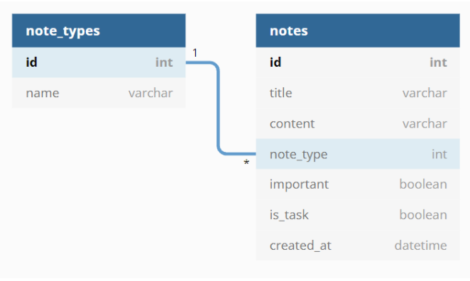
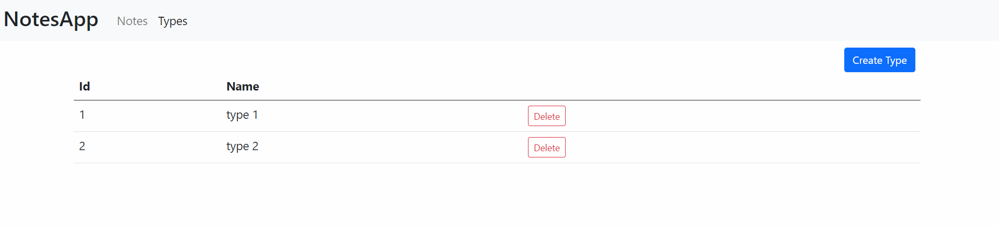
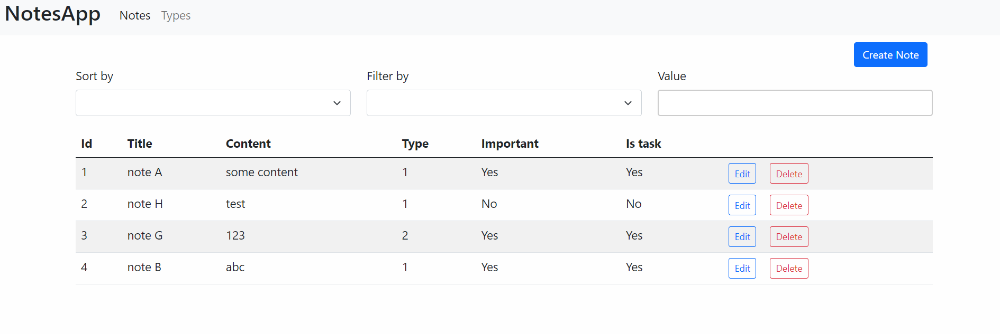
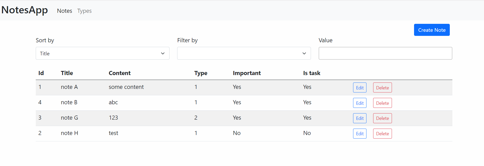
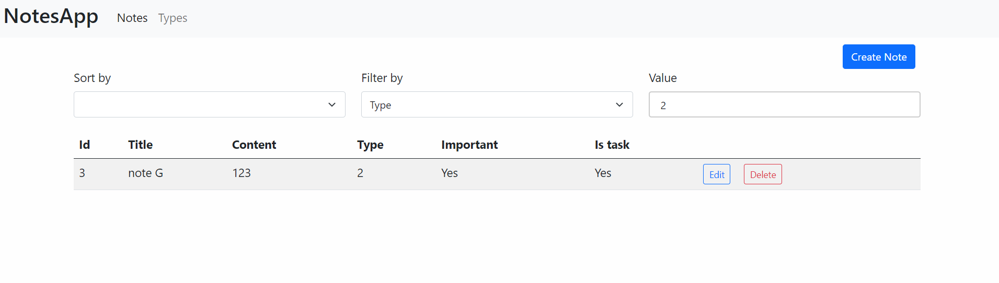
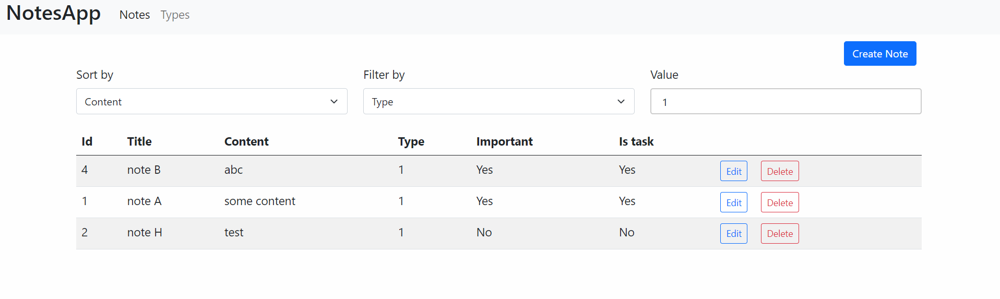

# 1. Temat Zadania

---

__Przy użyciu mikroframeworku Flask stwórz aplikację backend-ową komunikującą się z aplikacją frontend-ową.__

---

Aplikacja powinna realizować następujące zadania:

1. Posiadać zdefiniowane modele wraz z relacją w bazie danych.



2. Posiadać endpointy zwracające dane w formacie JSON oraz implementujące następujące czynności (model Note Type):  

   2.1. Nazwa endpointu `get_note_types`, adres endpointu `/get_note_types`:
      
      Zwraca listę wszystkich wierszy i ich wartości z tabeli `note_types`. Przykład zwróconej odpowiedzi:
      
      ```
      [
        {
            "id": 1,
            "name": "book"
        },
        {
            "id": 2,
            "name": "note"
        },
      ]
      ```
   
   2.2. Nazwa endpointu `add_note_type`, adres endpointu `/add_note_type`:

      Dodaje nowy rekord do tabeli `note_types` a następnie zwraca wiadomość:
      
      ```
      {'success': 'New note type added: {name}'}
      ```
    
    2.3. Nazwa endpointu `remove_note_type`, adres endpointu `/remove_note_type/<int:note_type_id>`:

      Usuwa rekord o podanym numerze id z tabeli `note_types` a następnie zwraca wiadomość:
      
      ```
      {'success': 'Note type deleted: {name}'}
      ```
    
3. Posiadać endpointy zwracające dane w formacie JSON oraz implementujące następujące czynności (model Note):  

   3.1. Nazwa endpointu `get_note`, adres endpointu `/get_note/<int:note_id>`:
   
      Zwraca rekord o podanym numerze id z tabeli `notes`. Przykład zwróconej odpowiedzi:
      
      ```
      {
        "content": "note content",
        "created_at": "Tue, 19 Oct 2021 09:24:32 GMT",
        "id": 4,
        "important": false,
        "is_task": true,
        "note_type": 4,
        "title": "note"
       }
      ```
   
   3.2. Nazwa endpointu `edit_note`, adres endpointu `/edit_note/<int:note_id>`:
   
      Zmienia wartości rekordu o podanym numerze id z tabeli `notes`. Przykład zwróconej odpowiedzi:
      
      ```
      {'success': 'Note modified for: {title}'}
      ```
   
      Przykładowa zawartość ciała zapytania HTTP, które endpoint obsłuży:
      
      ```
      {
        "id": "4",
        "title": "note",
        "content": "note content",
        "is_task": true,
        "important": false,
        "note_type": "4"
      }
      ```
   
   3.3. Nazwa endpointu `remove_note`, adres endpointu `/remove_note/<int:note_id>`:
   
      Usuwa rekordu o podanym numerze id z tabeli `notes`. Przykład zwróconej odpowiedzi:
      
      ```
      {'success': 'Note deleted: {title}'}
      ```
   
   3.4. Nazwa endpointu `add_note`, adres endpointu `/add_note`:
   
      Dodaje nowy rekord do tabeli `notes` a następnie zwraca wiadomość:
      
      ```
      {'success': 'New note added: {title}'}
      ```
   
      Przykładowa zawartość ciała zapytania HTTP, które endpoint obsłuży:
      
      ```
      { 
        "title": "new note",
        "content": "content 123",
        "note_type_id": "2",
        "important": true,
        "is_task": false
      }
      ```
   
   3.5. Nazwa endpointu `list`, adres endpointu `/list`:
   
      Zwraca listę wszystkich wierszy i ich wartości z tabeli `notes`. Przykład zwróconej odpowiedzi:
      
      ```
      [
        {
            "content": "new content",
            "created_at": "Tue, 19 Oct 2021 09:24:04 GMT",
            "id": 1,
            "important": true,
            "is_task": false,
            "note_type": 1,
            "title": "book1"
        },
        {
            "content": "content 123",
            "created_at": "Tue, 19 Oct 2021 09:24:14 GMT",
            "id": 2,
            "important": false,
            "is_task": true,
            "note_type": 3,
            "title": "note 123"
        },
      ]
      ```
   
      Dodatkowo eindpoint umożliwia sortowanie i filtrowanie rekordów poprzez wykorzystanie parametrów:
      - `/list?sort_by=<column_name>`
      - `/list?filter_by=<column_name>&filter_value=<column_value>`
      - `/list?filter_by=<column_name>&filter_value=<column_value>&sort_by=<column_name>`

   
4. Komunikować się z aplikacją frontend-ową poprzez wymianę danych w formacie JSON.

5. W katalogu głównym _(w katalogu `src`)_ mają się znajdować pliki *.py:

```python
# Z aplikacją flask
app.py

# Z modelemi
models.py

# Z endpointami
routes.py

# Z obsługą błędów
errors.py
```

6. Aplikacja ma być uruchamiana z poziomu konsoli na porcie `5000`:

```commandline
set FLASK_APP=app
set FLASK_ENV=development
flask run
```

7. Aplikacja powinna tworzyć plik sqlite o nazwie `test.db` w katalogu głównym aplikacji.

Przykładowe działanie aplikacji:


#### Sekcja `Types`


---

#### Sekcja `Notes`


---

#### Sekcja `Notes` z sortowaniem


---

#### Sekcja `Notes` z filtrowaniem


---

#### Sekcja `Notes` z sortowaniem oraz filtrowaniem


---

# 2. Ocena rozwiązania.

* poprawne zaimplementowanie wymaganych endpoint'ów i funkcjonalności.
* poprawne zwracanie danych przez endpoint`y.
* poprawne komunikacja między aplikacjami.
* przejście testów zdefiniowanych w katalogu tests.
* foramtowanie kodu zgodne z pep8.
* opinia prowadzącego na temat zaimplementowanego kodu.

# 3. Ustawienie środowiska pracy.

### 3.1. Klonowanie repozytoria z GitHub

- Lokalnie utwórz katalog roboczy dla repozytoriów z którymi bedziesz pracował w ramach zajęć. Np. katalog o nazwie _ztp_2021_. 

- sklonuj repozytorium dla bieżących zajęć z GitHub'a do katalogu roboczego.

  > `git clone <repository_url>`


### 3.2. Wirtualne środowisko 

- Przejdź do katalogu zawierające sklonowane repozytorium (dalej nazywany *katalog projektu*)

- Utwórz wirtualne środowisko pythona

  > `python3 -m venv .venv`

- Aktywuj wirtualne środowisko

  - Windows:

    > `.venv\Scripts\activate`

  - Unix lub MacOS:

    > `source .venv/bin/activate`

- Zainstaluj moduły `flask`

  > `pip install flask`

___

Więcej informacji n/t pracy z wirtualnym środowiskiem python możesz znaleźść w dokumentacji ["Virtual Environments and Packages"](https://docs.python.org/3.8/tutorial/venv.html)

# 4. Walidacja kodu zgodnie ze standardem pep8.

Do sprawdzenia formatowania kodu zgodnie ze standartem `pep8` użyj modułu `flake8`.

* Instalacja `flake8`:

  > `pip install flake8`

* Sprawdzenie czy plik `app.py` jest zgodny z `pep8`:

> `python -m flake8 app.py`

# 5. Obsługa CORS.

Dokumentacja https://flask-cors.readthedocs.io/en/latest/

Obsługa CORS jest niezbędna do nawiązania połączenia z aplikacja frontend.

* Instalacja `flask-cors`:

> `pip install flask-cors`

* Dodanie obsługi CORS do aplikacji flaskowej:

```python
# app.py

from flask import Flask
from flask_cors import CORS

app = Flask(__name__)
CORS(app)
```

# 6. Baza danych 'sqlite' przy użyciu SQLAlchemy.

Dokumentacja https://flask-sqlalchemy.palletsprojects.com/

* Instalacja `flask_sqlalchemy`:

> `pip install flask_sqlalchemy`

* Dodanie bazy danych do aplikacji flaskowej:

```python
# app.py

from flask_sqlalchemy import SQLAlchemy

app = Flask(__name__)
app.config['SECRET_KEY'] = 'some key'

# Ścieżka do bazy danych, w zeleżności od systemu operacyjnego 
# może być inna, odwiedz podaną stroną aby wybrać wersję dla swojego systemu
# https://flask-sqlalchemy.palletsprojects.com/en/2.x/config/#connection-uri-format
app.config['SQLALCHEMY_DATABASE_URI'] = 'sqlite:///test.db'

db = SQLAlchemy(app)
```

* Definiowanie modelów, importowanie do pliku app.py oraz tworzenie bazy danych:

```python
# models.py
from app import db

class TestModel(db.Model):
    __tablename__ = 'test_model'
    id = db.Column(db.Integer, primary_key=True)
    text_field = db.Column(db.String(80))

# app.py
...
import models

db.create_all()
```

* Dodanie danych do bazy danych:

```python
# Stworzenie instancji, dodanie do sesji i zapisanie do bazy danych.
model = Model(kolumna=warotść, ...)
db.session.add(model)
db.session.commit()
```

* Usunięcie danych z bazy danych:

```python
model = Model.query.get(1)
db.session.removie(model)
db.session.commit()
```

* Pobranie danych z bazy danych:

```python
# Przykłady pobrania danych z bazy danych.

# Wszystkie rekordy z bazy danych dla danego modelu.
Model.query.all()

# Pobranie pierwszego rekordu na podstawie szukanej wartości w polu      
# modelu.
Model.query.filter_by(pole_z_modelu=wartość_szukana).first()

# Pobranie po wartości klucza głównego
Model.query.get(1)
```

# 7. Flask.

Dokumentacja https://flask.palletsprojects.com/en/2.0.x/

* Definiowanie endpoint'ów przy pomocy dekoratora Flask @route.

```python
# app.py
from flask import request

@app.route('/users', methods=['GET', 'POST'])
def users():
  if request.method == 'GET':
    pass

  if request.method == 'POST':
    pass
```

* Konwersja danych do formatu JSON przy pomocy obiektu `jsonify`

```python
from flask import jsonify

@app.route('/users', methods=['GET'])
def users():
  ...
  return jsonify({'message': 'User has been created'})
```

* Obsługa błędów.

Konwertowanie wyjatków do postaci obiektu JSON.

```python
# errors.py
from flask import jsonify

from app import app


@app.errorhandler(Exception)
def handle_exception(e):
   errors = [err for err in str(e).split(',')]
   return jsonify({'errors': errors})

# app.py
...
import errors
```

# 7. Aplikacja frontend-owa.

Korzystając z pliku `noteApp.zip`.
- Wypakuj plik zip a następnie otwórz plik `index.html`. 
